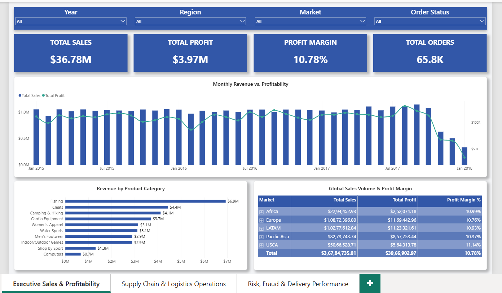
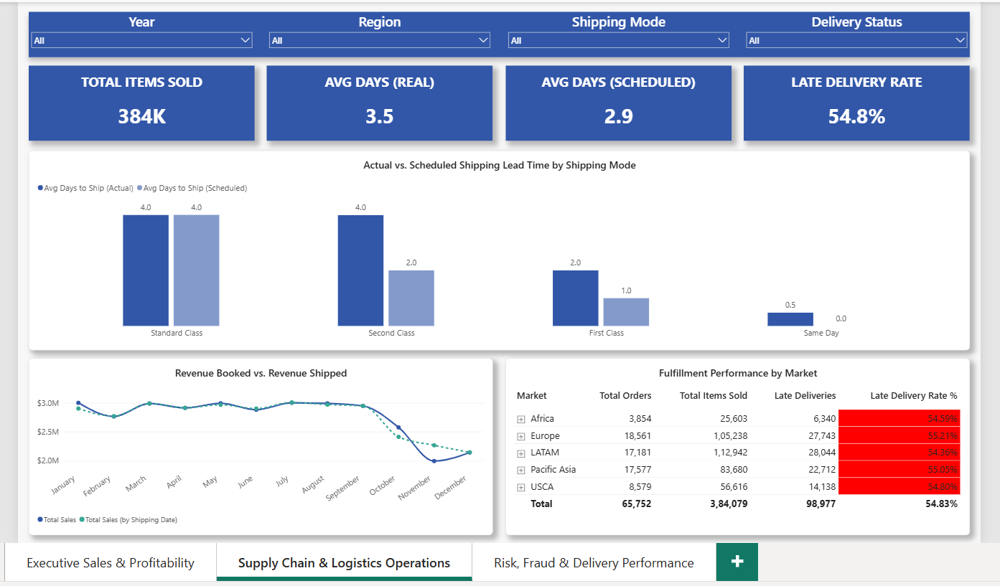
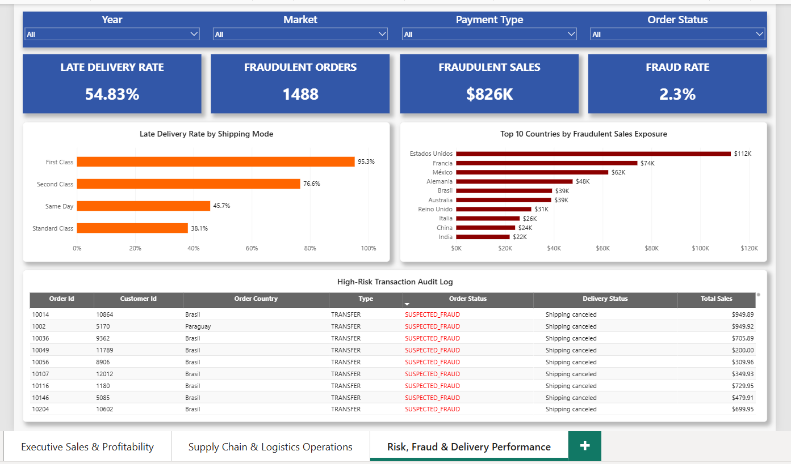

# 📦 DataCo Supply Chain Intelligence & Analytics Platform

[](#)
[](#)
[](#)
[](#)

An enterprise-grade, end-to-end Business Intelligence solution analyzing **180,500+ supply chain transactions** ($36.78M in gross revenue). This project features a full engineering pipeline: **Excel data profiling**, a **MySQL warehouse staging layer with recursive triage**, **Star Schema dimensional modeling**, and an **interactive 3-page Power BI executive dashboard**.

---

## 📑 Table of Contents

1. [Project Overview & Key Metrics](#project-overview)
2. [End-to-End Pipeline Architecture](#pipeline-architecture)
3. [Phase 1: Excel Data Quality Audit](#phase-1)
4. [Phase 2: MySQL Backend Architecture & Triage](#phase-2)
5. [Phase 3: Star Schema & DAX Data Modeling](#phase-3)
6. [Phase 4: Power BI Executive Dashboard](#phase-4)
7. [Business Impact & Strategic Recommendations](#business-impact)
8. [Repository Structure & Setup](#repo-setup)

---

<a id="project-overview"></a>

## 📊 Project Overview & Key Metrics

- **Total Revenue Analyzed:** $36.78M across global markets
- **Total Profit:** $3.97M (Overall Profit Margin: **10.80%**)
- **Total Line-Item Orders:** 180,516 records
- **Fulfillment Failure Rate:** **54.83%** (Late Delivery Risk)
- **Fraudulent Transaction Exposure:** $850K+ across high-risk payment channels

* **Data Source:** [DataCo Supply Chain Dataset by Sai Charan Komati (Kaggle)](https://www.kaggle.com/datasets/saicharankomati/dataco-supply-chain-dataset)

---

<a id="pipeline-architecture"></a>

## 🏗️ End-to-End Pipeline Architecture

```text
┌─────────────────────────┐     ┌─────────────────────────┐     ┌─────────────────────────┐
│   Phase 1: Excel Audit  │ ──> │   Phase 2: MySQL Layer  │ ──> │  Phase 3: Power BI BI   │
│ • PK Uniqueness Checks  │     │ • Staging Ingestion     │     │ • Star Schema (1:M)     │
│ • Datetime Profiling    │     │ • Recursive CTE Triage  │     │ • USERELATIONSHIP DAX   │
│ • Null Handling QA      │     │ • Window Functions      │     │ • 3-Page Executive View │
└─────────────────────────┘     └─────────────────────────┘     └─────────────────────────┘
```

---

<a id="phase-1"></a>

## 🔍 Phase 1: Excel Data Quality Audit

Before data ingestion, a diagnostic audit was performed on the raw CSV (180,519 records):

- _Primary Key Integrity_: Verified with =SUMPRODUCT(--(COUNTIF(AH2:AH180520, AH2:AH180520)>1)) resulting in 0 duplicate Order Item Id records.

- _Datetime Format Inconsistencies_: Identified mixed format patterns (M/D/YYYY H:MM vs. MM-DD-YYYY HH:MM:SS) requiring standardized ETL date parsing.

- _Sparsity & Nulls_: Uncovered 155,679 nulls (~86% missingness) in Order Zipcode, determining that customer geography must rely on Customer City / Customer State fallbacks.

- _Referential Integrity_: Confirmed 100% key consistency between Order Customer Id and customer entity profiles via XLOOKUP.

---

<a id="phase-2"></a>

## 🗄️ Phase 2: MySQL Backend Architecture & Triage

1. _The 3-Row Ingestion Triage (Recursive CTE Isolation)_

   During MySQL import, 180,516 rows were ingested out of 180,519. To locate the rejected records without manually parsing 180k rows, a recursive sequence CTE was executed:

**SQL**

    WITH RECURSIVE numbers AS (
    SELECT 1 AS id
    UNION ALL
    SELECT id + 1 FROM numbers WHERE id < 180519
    )
    SELECT numbers.id AS missing_order_item_id
    FROM numbers
    LEFT JOIN raw_dataco_orders r ON r.`Order Item Id` = numbers.id
    WHERE r.`Order Item Id` IS NULL;

- _Root Cause_: Isolated IDs 173808, 174339, and 176933. These records contained an empty string in the integer-defined Customer Zipcode column and transposed customer address fields (Customer State held 5-digit ZIPs; Customer Street held Cities).

- _Governance Decision_: Preserved raw staging purity without unverified manual imputation, keeping rejected records isolated in documentation.

2. _Analytical SQL Logic (`sql/03_pipeline_analytical_logic.sql`)_

- _Shipping Lead Time Variance (CTE)_: Calculates variance between actual vs. scheduled days and computes fulfillment failure rates per market and mode.

- _Product Margin Ranking (DENSE_RANK)_: Partitions products by market to isolate low-margin inventory bottlenecks.

- _Fraud Risk Categorization (CASE WHEN)_: Segments country-level fraud loss velocity into Critical, Moderate, and Low tiers.

---

<a id="phase-3"></a>

## 📐 Phase 3: Star Schema & DAX Data Modeling

The data model was normalized from a flat 53-column table into an optimized Star Schema with 1:M Single-Direction filter propagation:

- Fact Table: Fact_OrderItems (Grain: 1 row per Order Item Id)

- Dimension Tables: Dim_Customer, Dim_Product, Dim_OrderGeography, Dim_Date

       ┌────────────────┐            ┌──────────────────────┐
       │  Dim_Customer  │            │  Dim_OrderGeography  │
       └───────┬────────┘            └──────────┬───────────┘
               │ (1:M)                          │ (1:M)
               ▼                                ▼
      ═════════════════════════════════════════════════════════
                        Fact_OrderItems
      ═════════════════════════════════════════════════════════
               ▲                                ▲
               │ (1:M)                          │ (1:M Role-Playing)
       ┌───────┴────────┐            ┌──────────┴───────────┐
       │  Dim_Product   │            │       Dim_Date       │
       └────────────────┘            └──────────────────────┘

**Key DAX Measures**

    // Role-Playing Date Resolution
    Sales by Shipping Date =
    CALCULATE(
        [Total Sales],
        USERELATIONSHIP(Fact_OrderItems[shipping date (DateOrders)], Dim_Date[Date])
    )

    // Delivery SLA Failure Rate
    Late Delivery Rate % =
    DIVIDE(
        CALCULATE(COUNTROWS(Fact_OrderItems), Fact_OrderItems[Late_delivery_risk] = 1),
        [Total Orders],
        0
    )

    // Gross Profit Margin
    Profit Margin % =
    DIVIDE([Total Profit], [Total Sales], 0)

---

<a id="phase-4"></a>

## 🖥️ Phase 4: Power BI Executive Dashboard

📄 **Page 1: Executive Sales & Profitability**

- _KPIs_: Total Sales ($36.78M), Total Profit ($3.97M), Profit Margin (10.80%), Total Orders (180.5K).

- _Visuals_: Monthly revenue trend with profit overlay, category contribution bar charts, and multi-level market/country profitability matrix.



📄 **Page 2: Supply Chain & Logistics Operations**

- _KPIs_: Total Units Shipped (384K), Avg Days to Ship (3.50 Real vs. 2.93 Scheduled), Late Shipments (98.9K), SLA Failure Rate (54.83%).

- _Visuals_: Scheduled vs. Actual transit variance by Shipping Mode, Order Date vs. Shipping Date trend analysis, destination hub heatmaps.



📄 **Page 3: Risk, Fraud & Delivery Performance**

- _KPIs_: Suspected Fraud Orders (4,068), Fraud Rate (2.25%), Fraudulent Sales Exposure ($850K+).

- _Visuals_: Fraudulent sales concentration by country, payment method risk profiles (wire transfers vs. cards), granular drillthrough table for high-risk audits.



---

<a id="business-impact"></a>

## 💡 Business Impact & Strategic Recommendations

1. Address Logistics SLA Drift: Standard Class delivery fails scheduled timelines in over 55% of shipments. Adjust dynamic delivery estimates at web checkout by +1.2 days to improve customer retention.

2. Eliminate Negative-Margin Discounting: Enforce hard margin floors (>12%) on high-volume product categories like Apparel and Fan Shop.

3. Automate Transfer Payment Verification: Wire and electronic transfers represent over 60% of flagged fraud losses. Implement automated Address Verification Services (AVS) and MFA triggers on transfer orders over $200.

---

<a id="repo-setup"></a>

## ⚙️ Repository Structure & Setup

**Bash**

    # Clone the repository
    git clone [https://github.com/shreyanskh1/dataco-supply-chain-analytics.git](https://github.com/shreyanskh1/dataco-supply-chain-analytics.git)

    # Navigate to SQL scripts
    cd dataco-supply-chain-analytics/sql

1. Run 01_schema_setup.sql in MySQL Workbench.

2. Ingest the dataset into raw_dataco_orders.

3. Execute 02_data_quality_triage.sql to verify database integrity.

4. Run 03_pipeline_analytical_logic.sql to generate analytical views.

5. Open /pbix/DataCo_Supply_Chain_Report.pbix in Power BI Desktop to interact with the dashboard.

---
